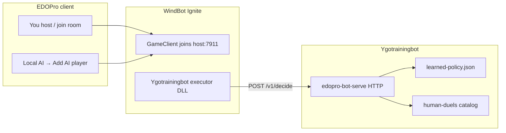

# Play against the training bot in EDOPro

EDOPro’s **Local AI** panel (WindBot Ignite) and **server / LAN rooms** do not talk to
`gateway.mjs` directly. They expect a **WindBot-style client** that joins the room on
the YGOPro network protocol (default host port **7911**).

Ygotrainingbot’s learned policy lives in Python (`learned-policy.json` + heuristic
scoring). To use that policy **inside EDOPro**, we bridge WindBot → Python over HTTP.

## Architecture



Until the WindBot executor is built, you can still **train and learn** with the
headless gateway (`train-format-pack`, dashboard jobs) and import human lines via
**Human replays** on the dashboard.

## Path A — Local AI (your screenshot)

1. **Host a room** in EDOPro (Single → Host). Note the host port (usually **7911**).
2. **Copy your bot deck** into EDOPro’s deck folder as `.ydk` (export from a format
   pack or use dashboard deck import).
3. **Start the Python policy server** (see below).
4. **Add the AI player**:
   - With the **Ygotrainingbot WindBot executor** (once built): pick that bot in the
     WindBot Ignite panel → **Add AI player**.
   - **Interim — Feelin’ Lucky**: set **Deck Engine** to **Feelin’ Lucky**, pick your
     `.ydk` in the deck dropdown. The AI will use your list but **not** your learned
     weights (generic play only).
5. Click **Start**. You play in the normal EDOPro UI; the bot joins as player 2.
6. After the duel, the bridge (or manual upload) feeds the log into **Human replays →
   Learn** so weights update.

### Copy launch arguments

EDOPro’s **Copy launch arguments** button produces WindBot command-line flags, e.g.:

```text
Name=TrainingBot Deck=gb test Host=127.0.0.1 Port=7911
```

You can run WindBot manually while testing:

```powershell
cd path\to\WindBot-Ignite\bin
.\WindBot.exe Name=TrainingBot Deck="gb test" Host=127.0.0.1 Port=7911
```

## Path B — Server / LAN link

Same protocol as Local AI: the bot is a **second client** connecting to
`host:port` (7911 on a local host, or your srvpro / Evolution Server address).

1. Join or host on the server (Server tab → connect to `ip:7911`).
2. Start `ygotrain edopro-bot-serve` on the machine running the WindBot bridge.
3. Spawn the bot:
   - **WindBot server mode** (HTTP spawner):

     ```text
     http://127.0.0.1:2399/?name=TrainingBot&deck=gb%20test&host=SERVER_IP&port=7911
     ```

   - Or command line: `WindBot.exe Host=SERVER_IP Port=7911 Deck=...`

4. When the duel ends, learning runs the same way as Path A.

## Start the Python policy server

From the repo root (with `EDOPRO_HOME` and gateway deps already set up for training):

```powershell
$env:PYTHONPATH = "src"
python -m ygotrainingbot.cli edopro-bot-serve `
  --policy data/learned-policy.json `
  --catalog-dir data/human-duels `
  --learn-after-duel
```

Endpoints:

| Method | Path | Purpose |
|--------|------|---------|
| POST | `/v1/start` | Begin a duel session (meta + player names) |
| POST | `/v1/decide` | Legal actions in → chosen `action_id` out |
| POST | `/v1/finish` | Result + optional trace → import + learn |

Default listen: `http://127.0.0.1:8765/`

## Learning from your games

After each duel logged by the bridge (or uploaded manually):

1. Dashboard → **Human replays** → upload JSON **or** rely on `--learn-after-duel`.
2. Set **study agent** to your player id (e.g. `you`) to imitate your lines, or the
   bot id to reinforce the bot when it won.
3. Click **Learn** — updates `data/learned-policy.json`.

Supported import formats: full `game-*.json` traces or lite `decisions` lists
(see `data/human-duels/examples/`). For `.yrpX` replays, run
`python -m ygotrainingbot.cli convert-edopro-replay path/to/replay.yrpX --import`
before uploading (legacy `.yrp` not supported yet).

## WindBot executor (developer build)

The C# bridge lives under `gateways/windbot-bridge/`. It must be compiled into
[ProjectIgnis/windbot](https://github.com/ProjectIgnis/windbot) or
[WindBot-Ignite](https://github.com/ProjectIgnis/WindBot-Ignite) and registered in
`bots.json`. See `gateways/windbot-bridge/README.md`.

## What works today vs next

| Feature | Status |
|---------|--------|
| Train bot on meta decks (gateway) | ✅ |
| Learn from self-play reports | ✅ |
| Import human JSON / dashboard Human replays | ✅ |
| EDOPro Local AI with **learned** policy | 🔧 needs WindBot executor + `edopro-bot-serve` |
| EDOPro Local AI with your **deck** only (Feelin’ Lucky) | ✅ now (no learned weights) |
| Convert `.yrpX` → JSON (`convert-edopro-replay`) | ✅ |
| Legacy `.yrp` conversion | ❌ use `.yrpX` |

## Troubleshooting Local AI

From the [Project Ignis FAQ](https://projectignis.github.io/faq.html):

- Install WindBot Ignite dependencies (bundled with EDOPro install).
- If the deck dropdown is empty: banlist may reject the AI deck — try **don’t check
  deck** when hosting.
- MR3+ only for WindBot; match your host settings to **2026 TCG** / MR5 as needed.
- Use **Feelin’ Lucky** deck engine to force any `.ydk` from your deck folder.
